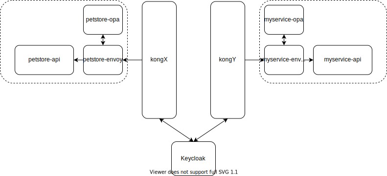

# Multi-gateway Keycloak Demo

This demo creates a setup as shown in the diagram below:



There are two instances of Kong gateway simulating a multi-tenant environment. Behind `kongX` is the `petstore`
service (to represent any arbitrary API service). Behind `kongY` is the `myservice` service built using the Python
FastAPI framework. `myservice` is used to demonstrate how one might make API calls to a service behind another gateway
(i.e. `petstore` behind `kongX`) using the same access token minted by Keycloak for `kongY`. Both `myservice` and
`petstore` are Resource Servers in OAuth2 terms.

Keycloak is the authorization server. Kong (using the [kong-oidc plugin](https://github.com/Revomatico/kong-oidc)) acts
as a proxying OAuth2 Resource Server and an OAuth2 Client/OpenID Connect Relying Party. This basically means Kong
terminates OAuth2/OpenID Connect in front of the upstream services so those upstream services can function as OAuth2
Resource Servers without implementing the functionalities themselves.

Additionally, Kong also maintains sessions which allows authenticated users through without authenticating again. Kong
also introspects tokens and allows requests with an accompanying access token through. However, the actual token
verification is still done by the upstream services (specifically by Envoy; see next).

Both upstream services are fronted by Envoy and Open Policy Agent instances. In this setup we leverage Envoy's external
authorization filter to call OPA to check whether an incoming request is authorized or not. Envoy also validates the
access token.

There are other utility services defined in `docker-compose.yml` that provide peripheral functions. Namely `traefik` to
provide SSL all around and to provide DNS-like routing (using subdomains of localhost and Docker network aliases), and
`konga` which provides an admin UI for Kong.

## Getting Started

Run `docker-compose -f docker-compose.yml -f docker-compose-keycloak.yml -f docker-compose-services.yml up` to get all
the services running. Starting this many services at a time seems to break docker-compose's `depends_on` behaviour and
cause some pretty strange startup errors.

If this happens, start the Kong instances first with `docker-compose -f docker-compose.yml up -d`. Then start Keycloak
with `docker-compose -f docker-compose-keycloak.yml up -d`. Lastly start the API services with `docker-compose -f
docker-compose-services.yml`.


Next we will configure both Kong instances, using [deck](https://github.com/Kong/deck) to load the relevant configs:
```
cat compose/kong/kongx_config.yaml | docker run -i --rm --network host kong/deck --kong-addr http://localhost:8001 sync
-s -

cat compose/kong/kongy_config.yaml | docker run -i --rm --network host kong/deck --kong-addr http://localhost:9001 sync
-s -
```

You can log into Konga at `https://localhost:1337`. Click "Connections" and select either KongX or KongY. Notice that
there are services, routes and plugins configured (when we loaded the config using deck above).

Lastly, we will configure Keycloak. This can be done via importing the existing config via the admin UI. Log into the
admin UI at `https://keycloak.localhost` using credentials `admin:password`.  Click import and import the
`compose/keycloak/realm.json` file, selecting "skip" if resource exists. Notice that the `myservice` and `petstore`
clients are created. They are also configured with client roles and mappers.

## Walking Through the Setup

### Calling `petstore` APIs

Navigate to `https://petstore.kongx.localhost`. You may be prompted to login if you weren't already logged into Keycloak
before. You may also want to open the link in a incognito session where you should be redirected to the Keycloak login 
page.

By default only the root page (along with its assets like `/openapi.json`) will be accessible according to the policy in
`compose/petstore/policy.rego`. Using any of the APIs will return a 403 as defined in the policy.

Now go to the Keycloak admin UI -> Users -> View All -> admin -> Role Mappings. Under Client Roles, select `petstore`
and add the `pet` role.

Now log out of petstore with `https://petstore.kongx.localhost/logout` and refresh the page to force obtain a new access
token with the new permissions.  Now you should be able to access all the `pet` APIs but not the `store` and `user`
unless you've also assigned those roles in Keycloak.

You may want to see the access token by going to Envoy's logs with `docker-compose -f docker-compose-services.yml logs
-f petstore-envoy`, looking for the `authorization` header, and copying the part after the `Bearer` prefix. Then you can
use a tool like [jwt.io](https://jwt.io) to decode this token. You should see something like the following:

```
"resource_access": {
  "petstore": {
    "roles": [
      "pet"
    ]
  }
}
```

This denotes the `pet` role for `petstore` that we assigned to user `admin` in Keycloak before. This is also the role
that OPA looks for when allowing access to the `pet` APIs.

### Calling `myservice` APIs

Navigate to `https://myservice.kongy.localhost`. Note the URL says `kongy` and not `kongx`.

You should see that `/whoami` echoes back the value of the `preferred_username` claim. In which case it should be
`admin` as defined in Keycloak. If you look in `/compose/myservice/app/main.py`, you should see that the function simply
reads the username from the `x-username` header. This `x-username` header is not passed by Kong. Instead it is populated
by OPA from the `preferred_username` claim in the access token (see `/compose/myservice/policy.rego`).

Similarly the access token is populated by OPA in the `authorization` header that the second API function for
`/addMultiplePets` relies on. This API calls the aforementioned `petstore` service by passing the access token along.

Try the `/addMultiplePets` API on the Swagger page. You should get a 403. This is because we have to configure Keycloak
to allow `myservice` to make calls to `petstore` with the `pet` role. To do this, go to Clients -> myservice -> Scope.
Under Client Roles, assign the `pet` role for `petstore`.

This is merely allowing `myservice` to call `petstore` with the `pet` role, it does not mean that the user `admin` has
such a permission. We would still have to go to Users -> admin -> Role Mappings to assign the `myservice`: `add` and
`petstore`: `pet` roles.

Now the `/addMultiplePets` API should succeed with a 201. If you call the `/pet/findByStatus` API in petstore for all
pets with "available" status, you should see the newly added pets.

If you decode the access token (following the instructions above), you should see that permissions for both `myservice`
and `petstore` are contained in the token:
```
  "resource_access": {
    "petstore": {
      "roles": [
        "pet"
      ]
    },
    "myservice": {
      "roles": [
        "add"
      ]
    }
  }
```

Also, the `aud` (audience) claim should show both `myservice` and `petstore`, which is why the same access token can be
used for both services.
